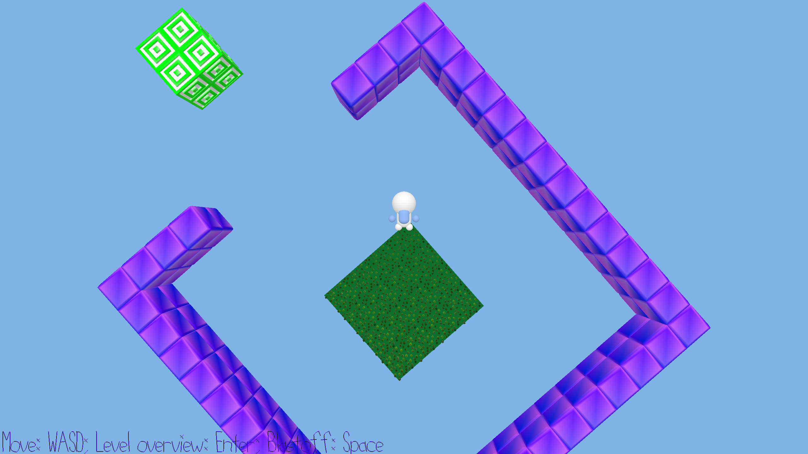

# Blastoff!

Author: Matei Budiu

Design: In this game, the player launches themselves as a projectile, navigating different gravity fields and trying to hit targets!

Screen Shot:

How To Play:

Use WASD to move the player on the spawn platform for a better shot. Then, use the mouse cursor to aim and press space to blast off!
Aim for the green and white target blocks, and avoid purple anti-matter! In later levels, gravity fields will appear which will
change your player's trajectory.

To get an overhead view of the whole level, press and hold enter.

Good luck!

This game was built with [NEST](NEST.md).
